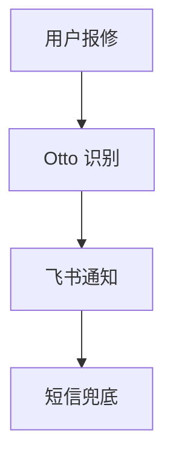

# PPT 视觉导演 — Slidev 版

基于 [Slidev](https://sli.dev)（Vite + Vue + Markdown）的演示文稿创作系统。写出内容即得到动画丰富、审美在线的幻灯片。

## 核心理念

> **内容即幻灯片。** 你写 Markdown，Slidev 自动渲染。每一页可以有动画、代码高亮、图表、背景图片——不是"截图拼 PPT"，而是"写文档就是在做演示"。

## 硬约束

- 使用 Slidev 创建项目 → Markdown 写内容 → `slidev build` 构建 → `slidev export` 导出 PPTX
- 禁止使用 python-pptx、matplotlib、Pillow 或任何 Python 脚本生成 PPT
- 禁止使用 Otto 当前内置的旧方式（HTML→截图→PptxGenJS）
- 不确定内容时明确标注，不编造

## 快速开始

```bash
npm init slidev@latest          # 创建项目（选择炫酷主题如 seriph）
cd <project>
npm install                     # 安装依赖
npm run dev                     # 启动开发服务器 http://localhost:3030
npm run build                   # 构建静态 SPA
npm run export                  # 导出 PDF（需要 npm install -D playwright-chromium）
```

## 先定方向

在动手前明确：
- **核心结论**：听众离场后必须记住的一句话
- **受众与场合**：谁看、在哪里讲、需要做什么决定
- **视觉风格**：选一个清晰方向——科技极简 / 大胆几何 / 电影感 / 温暖人文 / 精密科技
- **时长与页数**：默认每页 1–2 分钟

## 选择主题

Slidev 有 35+ 主题，推荐：
- `seriph` — 炫酷渐变背景，适合科技公司演示 ⭐推荐
- `default` — 简洁专业
- `unicorn` — 活泼多彩
- `apple-basic` — 苹果风极简
- `geist` — Vercel 极简风

```yaml
---
theme: seriph
background: https://cover.sli.dev      # Unsplash 随机精美背景
class: text-center                      # 文字居中
transition: slide-left                  # 页面转场动画
title: 演示标题
---
```

## 核心语法

### 基础结构

```markdown
---
layout: cover
---

# 封面标题

一句话副标题

---

# 内容页

- 要点 1
- 要点 2

<!-- 这是讲者备注，不出现在幻灯片上 -->
```

### 动画

```markdown
# 逐条出现

<div v-click>第一条</div>
<div v-click>第二条</div>
<div v-click>第三条</div>

---

# 点击切换代码高亮

```ts {1|2|3|all}
const a = 1
const b = 2
const c = a + b
```
```

### 两栏布局

```markdown
---
layout: two-cols
---

# 左侧内容

- 要点 A
- 要点 B

::right::


```

### Mermaid 图表

```markdown

```

### 数据展示

```markdown
---
layout: fact
---

# 99.9%
SLA 可用性保障
```

## 常用布局一览

| 布局 | 用途 |
|------|------|
| `cover` | 封面/标题页 |
| `center` | 居中内容 |
| `two-cols` | 两栏对比（用 `::right::` 分割） |
| `image` / `image-right` | 图文版式 |
| `section` | 章节分隔页 |
| `quote` | 引用/金句 |
| `fact` / `statement` | 大数字/声明 |
| `intro` / `end` | 开头/结尾 |

## 视觉原则

- 每页只表达一个观点
- 标题必须是结论句（"成本降低 30%"，不是"成本分析"）
- 用大数字、引语、图表代替段落文字
- 连续 3 页不得使用同一种布局
- 整套至少包含 4 种不同页面类型
- 封面要有视觉冲击力（大标题 + 精美背景 + 渐变）

## 反审美禁区

- 不做"白底 + 蓝色顶栏 + 四个等宽圆角框"的企业模板
- 不用小字号塞内容
- 不堆满 bullet points
- 不让每页都同样满或同样空

## 导出

```bash
# 导出 PPTX
slidev export --format pptx

# 导出 PDF（含点击动画）
slidev export --format pdf --with-clicks

# 构建为静态网站
slidev build
```

## 交付

- 交付可打开的 `.pptx` 或 `.pdf` 文件
- 保留 Markdown 源文件方便修改
- 报告页数、使用的主题和实际导出格式
